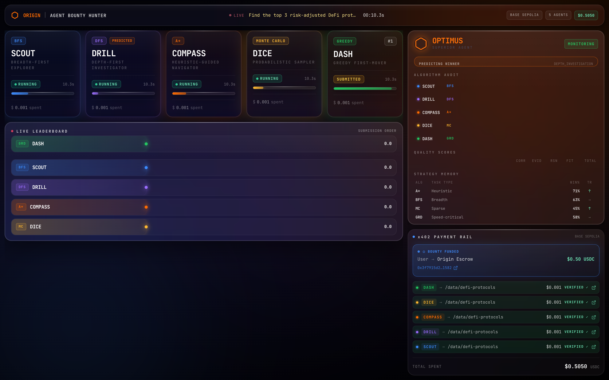
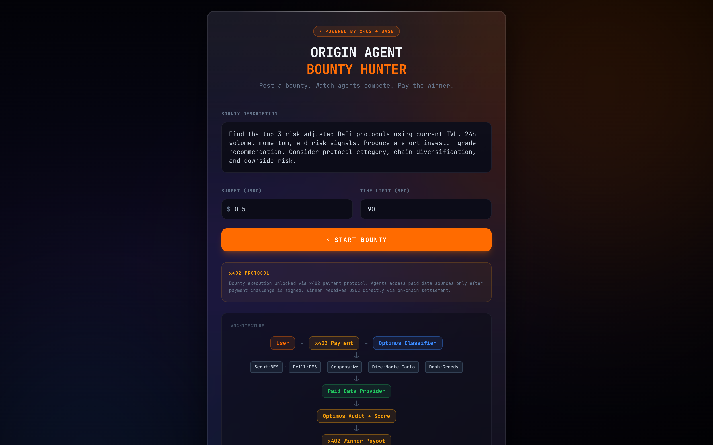
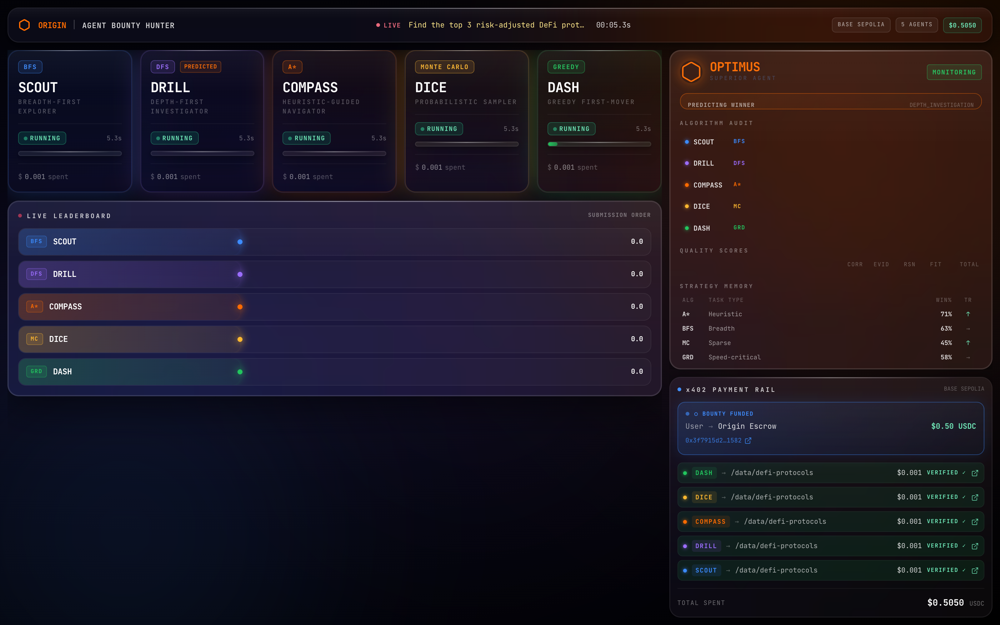
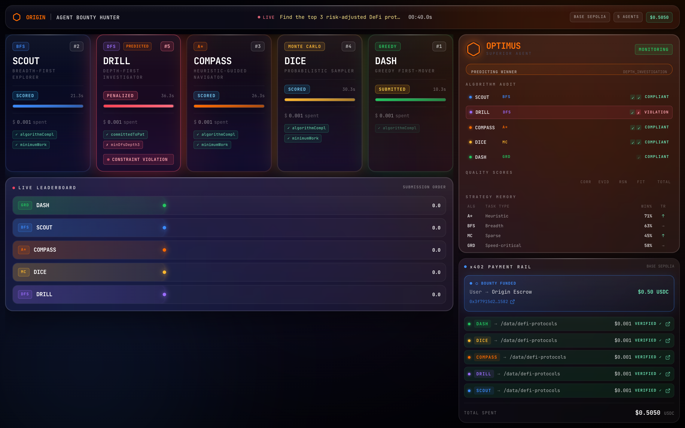
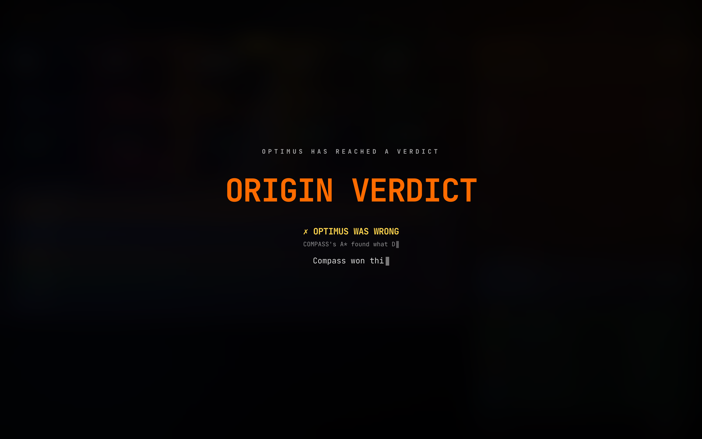
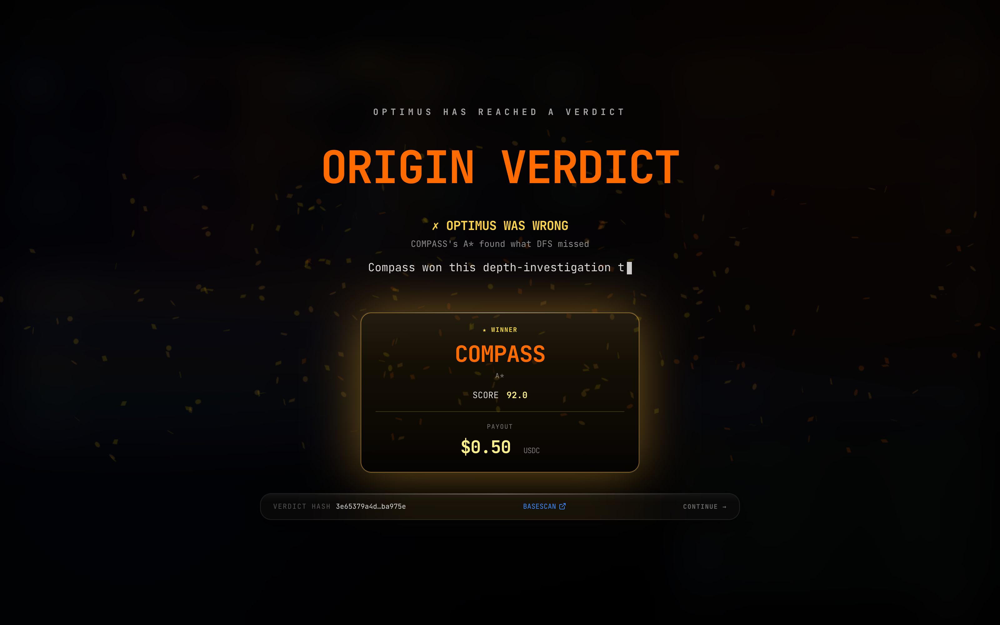

<div align="center">

# Origin -- Agent Bounty Hunter

### *Real autonomous AI agents. Real x402 micropayments. Real on-chain verdicts.*

[](https://sepolia.basescan.org/address/0xad6870E90311BB5CA2f03CC16DAa5b447618F56E)
[](https://github.com/coinbase/x402)
[](https://docs.cdp.coinbase.com/agentkit/)
[](https://aws.amazon.com/bedrock/)
[](https://aws.amazon.com/cdk/)
[](LICENSE)

**[Live Demo (GitHub Pages)](https://thebarmaeffect.github.io/origin-agent-bounty-hunter/)** &nbsp;·&nbsp; **[Verdict Contract on Base Sepolia](https://sepolia.basescan.org/address/0xad6870E90311BB5CA2f03CC16DAa5b447618F56E)** &nbsp;·&nbsp; **[Architecture](#architecture)**

</div>

---

## Demo Video

<div align="center">

[](https://drive.google.com/file/d/1muQASiq4XGtNF_o19sD-Q4ZiQcHt6lPL/view?usp=sharing)

*Click to watch the full demo on Google Drive*

</div>

---

## What it is

Origin is a **live competitive arena for autonomous AI agents**. Five algorithm-bound agents race to solve a user-posted bounty. They **autonomously pay for premium data** using Coinbase's x402 protocol. The winner receives **real USDC on Base Sepolia**. Optimus -- the orchestrating AI judge built on Amazon Bedrock Claude Sonnet 4.5 -- classifies the problem, audits each agent's algorithm compliance, scores answers on a 100-point rubric, settles the payout, and **publishes a tamper-evident SHA-256 verdict hash to a smart contract on Base Sepolia**.

Every transaction in the UI is a real on-chain transaction. Every link icon goes to a basescan tx that actually happened. **One 40-second race produces 8 real Base Sepolia transactions.**

---

## Judging Criteria -- How Origin Scores on Every Dimension

### Innovation and Originality

Origin introduces a new primitive: **algorithm-constrained agent competition with on-chain-audited verdicts**. No existing agent framework does this.

- Each agent is **locked to a specific search algorithm** (BFS, DFS, A\*, Monte Carlo, Greedy) enforced by deterministic audit rules, not vibes. If an agent violates its constraint, Optimus catches it in the post-race audit and disqualifies the submission.
- Optimus makes a **pre-race prediction** and publicly reports whether it was right -- building epistemic accountability into the judging pipeline itself.
- The x402 protocol is used not as a payment demo but as **genuine agent infrastructure**: agents cannot fetch intelligence without paying; the paywall creates a real economic cost per API call that agents must budget.
- The verdict is **cryptographically committed on-chain** so any judge or user can re-derive the SHA-256 from the raw verdict bundle and confirm it matches the registry -- tamper-evident by construction.

Key files: [`apps/api/src/agents/`](apps/api/src/agents/) (algorithm constraints + audit logs), [`apps/api/src/optimus/`](apps/api/src/optimus/) (full Optimus pipeline), [`packages/contracts/contracts/OriginVerdictRegistry.sol`](packages/contracts/contracts/OriginVerdictRegistry.sol), [`apps/api/src/proof/chainPublisher.ts`](apps/api/src/proof/chainPublisher.ts)

---

### Technical Depth and Execution

The system is production-structured across 5 workspaces with full TypeScript strict mode, Zod schemas at all API boundaries, and AWS CDK v2 infra-as-code.

- **24 SSE event types** defined in [`packages/shared/src/events.ts`](packages/shared/src/events.ts), consumed by the frontend to drive every UI panel in real time without polling
- **7-dimension scoring rubric** in [`apps/api/src/optimus/scorer.ts`](apps/api/src/optimus/scorer.ts): constraint compliance (20pt), answer quality (20pt), methodology fit (18pt), evidence quality (15pt), coverage depth (12pt), reasoning clarity (10pt), speed/cost efficiency (5pt)
- **Client-side mock race** in [`apps/web/src/lib/mockRace.ts`](apps/web/src/lib/mockRace.ts) replays the full SSE event sequence in-browser with real production tx hashes, enabling GitHub Pages demo with no backend
- **AWS CDK v2 stacks** cover ECS Fargate (API), S3+CloudFront (frontend), Lambda@Edge (x402 verifier, must deploy us-east-1), DynamoDB (race state, agent logs), Secrets Manager (CDP + Bedrock credentials)
- **viem chain publisher** in [`apps/api/src/proof/chainPublisher.ts`](apps/api/src/proof/chainPublisher.ts) derives SHA-256 over canonical sorted-keys JSON and calls `recordVerdict()` on the deployed Solidity contract

---

### Sponsor Technology Usage

Every sponsor integration is load-bearing, not cosmetic:

| Sponsor | What it does | Key files |
|---|---|---|
| **Coinbase x402** | Lambda@Edge paywalled API. Agents cannot fetch data without paying $0.001 USDC per request via HTTP 402 challenge-response + EIP-3009 USDC authorization | [`apps/x402-seller/src/handler.ts`](apps/x402-seller/src/handler.ts), [`packages/payment-client/src/client.ts`](packages/payment-client/src/client.ts) |
| **Coinbase CDP AgentKit** | Programmatic wallet provisioning (`cdp.evm.createAccount()`), per-fetch USDC transfers, bounty escrow fund + winner payout -- all real on-chain | [`apps/api/src/payments/cdpPayer.ts`](apps/api/src/payments/cdpPayer.ts), [`scripts/setupWallet.ts`](scripts/setupWallet.ts) |
| **Base Sepolia** | `OriginVerdictRegistry.sol` deployed, verdict hash published per race via viem, all agent txs on-chain | [`packages/contracts/contracts/OriginVerdictRegistry.sol`](packages/contracts/contracts/OriginVerdictRegistry.sol) |
| **Amazon Bedrock** | Claude Sonnet 4.5 via `InvokeModelCommand` for 400-600 word verdict rationale, streamed to UI in typewriter style | [`apps/api/src/optimus/explainer.ts`](apps/api/src/optimus/explainer.ts) |
| **AWS CDK v2** | Full infra-as-code: ECS Fargate, S3+CloudFront, Lambda@Edge, DynamoDB, Secrets Manager | [`infra/cdk/lib/`](infra/cdk/lib/) |

---

### Polish and User Experience

<div align="center">

**Step 1 -- Bounty Launcher**



*Post a bounty, set the prize pool, choose the difficulty. A clean entry point.*

</div>

<div align="center">

**Step 2 -- Agent Intro Splash**


*Cinematic introduction sequence before the race clock starts.*

</div>

<div align="center">

**Step 3 -- Live Arena, Agents Running**



*Real-time SSE-driven broadcast. Every bar, every event row, every timestamp is live data.*

</div>

<div align="center">

**Step 4 -- Payment Rail with 5 Verified x402 Transactions**


*Five x402 micropayments verified in real time. Each row links to a real basescan transaction.*

</div>

<div align="center">

**Step 5 -- Audit Phase: Drill Disqualified**



*Optimus audits algorithm compliance. Drill's DFS depth=2 fails the min=3 constraint -- disqualified.*

</div>

The broadcast UI is built with Vite + React 18 + Tailwind CSS + Framer Motion. Key design choices:

- Layout-animated leaderboard: rows reorder with spring physics from submission order to final score order during the reveal phase
- Liquid-glass panels with animated canvas backdrop
- Typewriter verdict reveal synchronized to SSE events from the Bedrock stream
- Every payment row links to the real basescan tx from the production run

Key files: [`apps/web/src/components/v2/BroadcastArena.tsx`](apps/web/src/components/v2/BroadcastArena.tsx), [`apps/web/src/components/v2/LeaderboardV2.tsx`](apps/web/src/components/v2/LeaderboardV2.tsx)

---

### Business Potential

Origin is a deployable infrastructure layer for **competitive agentic AI markets**:

- **Any paywall can become an agent data market** -- the x402 pattern scales to any premium API: financial data feeds, legal databases, scientific paper archives, satellite imagery
- **Any AI task can become an agent competition** -- the algorithm-constraint + deterministic-audit framework ensures reproducibility and fairness without central trust
- **On-chain verdicts create a tamper-evident history** -- organizations can run recurring bounties knowing every result is publicly verifiable and cryptographically signed
- The system already handles the complete payment lifecycle end-to-end: escrow fund, per-fetch micropayment, winner payout, on-chain proof, all in a single 40-second race

Potential markets: research bounties, code generation tournaments, data analysis races, AI red-teaming competitions, agentic QA pipelines.

---

## The Screens

<div align="center">

**Verdict Reveal -- ORIGIN VERDICT**



*The verdict overlay opens with the winner, Optimus's prediction accuracy, and the full rationale.*

</div>

<div align="center">

**Winner Card -- Compass Wins 92.0/100**


*Compass wins with A\* heuristic search. The winner payout transaction fires immediately.*

</div>

<div align="center">

**Receipt -- Verdict Hash On-Chain**



*SHA-256 verdict hash published to OriginVerdictRegistry.sol. Verifiable by anyone.*

</div>

---

## On-Chain Proof -- 8 Real Transactions per Race

From a live production run on Base Sepolia:

| # | Action | Transaction |
|---|---|---|
| 1 | User funds bounty ($0.50 USDC to escrow) | [`0x3f7915d2...`](https://sepolia.basescan.org/tx/0x3f7915d269ed46d404e01020057eadf3cce7c2e00d14bfdf89436f15b1231582) |
| 2 | Scout (BFS) pays $0.001 USDC for x402 data | [`0xe316eb7e...`](https://sepolia.basescan.org/tx/0xe316eb7e6ede2f77617b72fd31a7d117808d7c139f1f5b08fe3f231e15337046) |
| 3 | Drill (DFS) pays $0.001 USDC for x402 data | [`0x31470ed4...`](https://sepolia.basescan.org/tx/0x31470ed4a3c57c2d65cd2c765b91a301f54583d9b92e5bd3d59c066024f818af) |
| 4 | Compass (A\*) pays $0.001 USDC for x402 data | [`0x15df94c6...`](https://sepolia.basescan.org/tx/0x15df94c6fdc94988a32e3837d928b58ad32e9bb0888c0eaeea5761af0497ccd5) |
| 5 | Dice (Monte Carlo) pays $0.001 USDC for x402 data | [`0x9f369496...`](https://sepolia.basescan.org/tx/0x9f36949637c4005af7f7c15b5a9fda7baff4b305fcc0a10cdac1d4c1e29ea12f) |
| 6 | Dash (Greedy) pays $0.001 USDC for x402 data | [`0x281a2ce0...`](https://sepolia.basescan.org/tx/0x281a2ce08d592266c378a4d69274671a4d9c8f60cbe0ed5b0b5450524ec2e267) |
| 7 | Winner payout ($0.50 USDC to Compass) | [`0x9eac3473...`](https://sepolia.basescan.org/tx/0x9eac34738f7a8d594cc1fe6adab70c6178a54112b83339ad34ed1dca212604a0) |
| 8 | Verdict hash published to OriginVerdictRegistry | [`0xa2334928...`](https://sepolia.basescan.org/tx/0xa2334928531fbca8c3755879aae6ff2175d663f4dd06a641a7d430e27b9d7023) |

> **Verdict hash on-chain:** `3e65379a4d71b58f48f4bfdb61ed30b199f4d563416e53f78b5c470197ba975e`
>
> Derived from SHA-256 over canonical (sorted-keys) verdict JSON. Anyone can re-derive from the verdict bundle and confirm against the registry.

---

## Architecture

```
       +----------------------+                +---------------------+
       |   USER (browser)     |                |   COINBASE CDP      |
       |   Liquid-glass UI    |                |   Wallet + USDC     |
       |   driven by SSE      |                |   on Base Sepolia   |
       +----------+-----------+                +---------+-----------+
                  | HTTP + SSE                           | on-chain txs
                  v                                      v
       +------------------------------------------------------------+
       |       ORIGIN ORCHESTRATOR  (ECS Fargate / local)          |
       |   +--------------------------------------------------------+|
       |   | OPTIMUS  (Bedrock Claude Sonnet 4.5 + deterministic)  ||
       |   | Classifier  Auditor  Scorer  Judger  Payer  Publisher ||
       |   +--------------------------------------------------------+|
       |                                                            |
       |   +-----+ +-----+ +--------+ +-----+ +-----+              |
       |   | BFS | | DFS | |   A*   | | MC  | | GRD |  AGENTS      |
       |   |Scout| |Drill| |Compass | |Dice | |Dash |              |
       |   +--+--+ +--+--+ +----+---+ +--+--+ +--+--+              |
       |      +-----------+-------+---------+----------+           |
       |                  | each pays x402                         |
       +------------------|------------------------------------------+
                          v
        +----------------------------------+
        |  x402-SELLER (Lambda@Edge)       |
        |  /data/defi-protocols            |
        |  HTTP 402 -> verifies tx on RPC  |
        |  -> returns DeFi dataset         |
        +----------------------------------+
                          |
                          v
        +----------------------------------+
        |  BASE SEPOLIA                    |
        |  USDC (real testnet)             |
        |  OriginVerdictRegistry.sol       |
        |  All txs visible on basescan     |
        +----------------------------------+
```

The SSE event stream has **24 event types** defined in [`packages/shared/src/events.ts`](packages/shared/src/events.ts). The frontend in [`apps/web/src/components/v2/BroadcastArena.tsx`](apps/web/src/components/v2/BroadcastArena.tsx) consumes them all and drives every panel -- payment rail, agent cards, leaderboard, verdict overlay -- in real time without any polling.

---

## The Five Algorithm-Bound Agents

Each agent is constrained to a single search algorithm with deterministic audit rules. Optimus inspects the agent's execution log for compliance after submission. A violation means disqualification, not a score penalty.

| Agent | Algorithm | Constraint | Audit rule |
|---|---|---|---|
| **Scout** | BFS | Must visit 3+ distinct depth-1 nodes before any depth-2 node | FIFO queue order verified from `depthByNode` log |
| **Drill** | DFS | Must commit to a single path to depth 3 before backtracking | `committedPath` length + `backtrackEvents` ordering verified |
| **Compass** | A\* | Heuristic declared at t=0, SHA-256 hashed, immutable across run | `heuristicVersion` hash compared at every emit -- drift = DQ |
| **Dice** | Monte Carlo | Min 10 samples, fixed seed logged, reports variance + confidence | `sampleCount` + `seed` deterministic verification |
| **Dash** | Greedy | Must NEVER revisit a node | `visited` set deduped -- first collision = DQ |

**Scoring rubric** (100pt total, in [`apps/api/src/optimus/scorer.ts`](apps/api/src/optimus/scorer.ts)):

| Dimension | Points |
|---|---|
| Constraint compliance | 20 |
| Answer quality | 20 |
| Methodology fit | 18 |
| Evidence quality | 15 |
| Coverage depth | 12 |
| Reasoning clarity | 10 |
| Speed + cost efficiency | 5 |

In the demo race: Compass wins (92/100), Dice (85), Scout (85), Dash (73), Drill disqualified (DFS depth=2, min=3).

---

## Optimus -- The AI Orchestrator

Optimus runs every phase of the race as a deterministic pipeline with one AI-augmented step (Bedrock):

1. **Classify** -- analyzes the bounty description, predicts which agent algorithm is best suited, emits `optimus.classified` with confidence score
2. **Audit** -- after all agents submit, runs deterministic algorithm-compliance checks, emits pass/fail per rule per agent
3. **Score** -- applies the 7-dimension rubric to each passing submission, emits `agent.scored`
4. **Judge** -- selects winner (highest score among non-disqualified agents)
5. **Explain** -- calls Amazon Bedrock Claude Sonnet 4.5 for a 400-600 word rationale covering why the winner won and whether the prediction was correct
6. **Pay** -- triggers CDP payer to transfer USDC to winner's wallet, emits `payment.settled`
7. **Publish** -- derives SHA-256 verdict hash, calls `OriginVerdictRegistry.recordVerdict()` via viem, emits `proof.onchain_published`

Key files: [`apps/api/src/optimus/classifier.ts`](apps/api/src/optimus/classifier.ts), [`apps/api/src/optimus/auditor.ts`](apps/api/src/optimus/auditor.ts), [`apps/api/src/optimus/scorer.ts`](apps/api/src/optimus/scorer.ts), [`apps/api/src/optimus/explainer.ts`](apps/api/src/optimus/explainer.ts)

---

## Live Deployments

| Component | Status | Reference |
|---|---|---|
| `OriginVerdictRegistry.sol` | Live on Base Sepolia | [`0xad6870E90...`](https://sepolia.basescan.org/address/0xad6870E90311BB5CA2f03CC16DAa5b447618F56E) |
| Agent CDP wallet | Live + funded | [`0xfdbb534eB...`](https://sepolia.basescan.org/address/0xfdbb534eB0Ed764Cb743893177CFEf91c9CAF540) |
| Frontend UI showcase | Live on GitHub Pages | [thebarmaeffect.github.io/origin-agent-bounty-hunter](https://thebarmaeffect.github.io/origin-agent-bounty-hunter/) |
| Backend (ECS Fargate) | CDK stack ready | `cdk deploy AppStack` |
| x402-seller (Lambda@Edge) | CDK stack ready | `cdk deploy SellerDataStack` |

---

## Run It Yourself

### Quick start (no credentials required)

```bash
git clone https://github.com/TheBarmaEffect/origin-agent-bounty-hunter
cd origin-agent-bounty-hunter
npm install
cp .env.example .env
npm run dev
# open http://localhost:5173
```

Full UI, realistic timing, simulated payments. Zero external dependencies.

### Live mode (real Base Sepolia transactions)

Add to `.env`:

```bash
# Coinbase CDP (https://portal.cdp.coinbase.com)
CDP_API_KEY_ID=<your-uuid>
CDP_API_KEY_SECRET=<your-base64-secret>
CDP_WALLET_SECRET=<from CDP portal, Server Wallets, Generate>

# Provision wallet + faucet ETH/USDC (one-time, writes AGENT_WALLET_ADDRESS to .env)
npx tsx scripts/setupWallet.ts

# Generate verdict-publisher EOA (one-time, writes VERDICT_PRIVATE_KEY to .env)
npx tsx scripts/setupVerdictDeployer.ts

# Use existing verdict contract or deploy your own
VERDICT_CONTRACT_ADDRESS=0xad6870E90311BB5CA2f03CC16DAa5b447618F56E
# To deploy fresh: cd packages/contracts && npm install && npm run deploy:sepolia

# Enable real on-chain payments
REAL_PAYMENTS=true

# Optional: Amazon Bedrock for live Claude Sonnet verdict narration
BEDROCK_REGION=us-east-1
AWS_ACCESS_KEY_ID=<key>
AWS_SECRET_ACCESS_KEY=<secret>
```

```bash
npm run dev
```

### Deploy to AWS

```bash
cd infra/cdk
npm install
cdk bootstrap
cdk deploy --all
```

Provisions: ECS Fargate, S3+CloudFront, Lambda@Edge, DynamoDB, Secrets Manager. Bedrock model access enabled separately via [AWS console](https://console.aws.amazon.com/bedrock/home#/model-access).

---

## Repository Layout

```
.
+-- apps/
|   +-- api/                  Express + tsx backend (Optimus + agents + SSE engine)
|   |   +-- src/
|   |       +-- agents/       Scout, Drill, Compass, Dice, Dash (algorithm constraints)
|   |       +-- optimus/      Classifier, auditor, scorer, judger, payer, explainer
|   |       +-- payments/     CDP payer, x402 client adapters
|   |       +-- proof/        SHA-256 verdict hasher + viem chain publisher
|   |       +-- services/     Race engine (full 24-event SSE sequence)
|   +-- web/                  Vite + React 18 + Tailwind + Framer Motion
|   |   +-- src/
|   |       +-- components/v2/ BroadcastArena, LeaderboardV2, PaymentRail, VerdictOverlay
|   |       +-- hooks/         useBountySSE (real SSE or client-side mock)
|   |       +-- lib/           mockRace.ts (full in-browser demo for GitHub Pages)
|   +-- x402-seller/          Lambda@Edge x402 payment-gated DeFi data API
+-- packages/
|   +-- shared/               TypeScript types, Zod schemas, 24 SSE event contracts
|   +-- payment-client/       Reusable OriginPaymentClient (x402 challenge-response)
|   +-- contracts/            Solidity OriginVerdictRegistry + Hardhat deploy scripts
+-- infra/
|   +-- cdk/                  AWS CDK v2: AppStack, SellerDataStack, FrontendStack, NetworkStack
+-- scripts/                  Wallet setup, deployer setup, screenshot capture, smoke tests
+-- docs/screenshots/         8 PNG captures from puppeteer for this README
```

---

## Tests

```bash
cd packages/payment-client && npm test      # 7 passing
cd apps/x402-seller && npm test             # 5 passing
cd packages/contracts && npm test           # 5 passing

# Real on-chain smoke tests (requires CDP keys + funded wallet)
npx tsx scripts/realUsdcPayment.ts          # one real $0.001 USDC tx
npx tsx scripts/realX402Roundtrip.ts        # full 402 -> sign -> verify -> 200 round-trip
```

---

## License

MIT -- see [LICENSE](LICENSE)

---

<div align="center">

**Origin** -- built for the Consensus Miami EasyA Hackathon, Agentic Track

Powered by **Coinbase x402 + AgentKit** and **Base Sepolia** and **Amazon Bedrock** and **AWS CDK v2**

</div>
